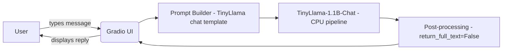

# Week 1 — Simple Local Chat Demo

> Part of the [cloudtoailearn.dev](https://cloudtoailearn.dev/) AI demo series.
> **Live demo:** [Add HF Spaces link here once deployed]

## What this demonstrates

A minimal conversational chat UI built entirely on CPU — no paid APIs, no cloud inference costs.
Shows end-to-end delivery: prompt design → local model → Gradio UI → public deployment.

**Problem it solves:** How do you prototype a chat interface and test prompt patterns without paying for API calls?

## Architecture



## Tech stack

| Component | Choice | Why |
|---|---|---|
| UI | Gradio 6.x | Free hosting on HF Spaces, built-in chat component |
| Model | TinyLlama-1.1B-Chat | Instruction-tuned, CPU-friendly, ~1.1GB, real answers |
| Runtime | HuggingFace transformers | Standard, well-documented |
| CI | GitHub Actions | Free for public repos |

## Run locally

```bash
python -m venv venv
venv\Scripts\activate        # Windows
# source venv/bin/activate   # Mac/Linux
pip install -r requirements.txt
python app.py
```

Open **http://127.0.0.1:7860**

> On Windows always use `127.0.0.1` — not `localhost` or `0.0.0.0`

## Environment variables

Copy `.env.example` to `.env` and fill in your values:

```bash
copy .env.example .env   # Windows
# cp .env.example .env   # Mac/Linux
```

| Variable | Default | Description |
|---|---|---|
| `HF_TOKEN` | — | Free token from https://huggingface.co/settings/tokens |
| `PROVIDER` | `hf` | `hf` / `ollama` / `groq` |
| `MODEL_NAME` | `TinyLlama/TinyLlama-1.1B-Chat-v1.0` | Any HF causal LM or Ollama model name |
| `MAX_NEW_TOKENS` | `200` | Max tokens generated per reply |
| `GROQ_API_KEY` | — | Only needed if `PROVIDER=groq` |

## Swap the model (no code change needed)

```bash
# Better quality, needs more RAM
set MODEL_NAME=microsoft/phi-2

# Local Ollama — install from https://ollama.com first
set PROVIDER=ollama
set MODEL_NAME=mistral

# Free cloud API via Groq
set PROVIDER=groq
set GROQ_API_KEY=your_key_here
```

## Deploy to Hugging Face Spaces

1. Push this repo to GitHub (public)
2. Go to https://huggingface.co/spaces → New Space → Gradio
3. Connect your GitHub repo
4. Add `HF_TOKEN` as a Space secret (Settings → Variables and secrets)
5. HF builds and hosts automatically — share the Space URL in your LinkedIn post

## Limitations

- CPU only — TinyLlama responses take 5–15 seconds on a standard laptop
- No persistent memory between sessions
- Not production-ready — demo only, see `DISCLAIMER.md`

## Week 2 — Prompt Engineering & Safety

This repository now includes the Week 2 guide for adding prompt guardrails, refusal handling, output validation, rate limiting, and toxicity filtering.

- Follow the step-by-step guide in `WEEK2_PROMPT_ENGINEERING.md`
- Add safety patterns before you upgrade model quality
- Share your progress using the GitHub repo and the Week 2 guide link

## License

MIT
See `DISCLAIMER.md` for demo limitations.
